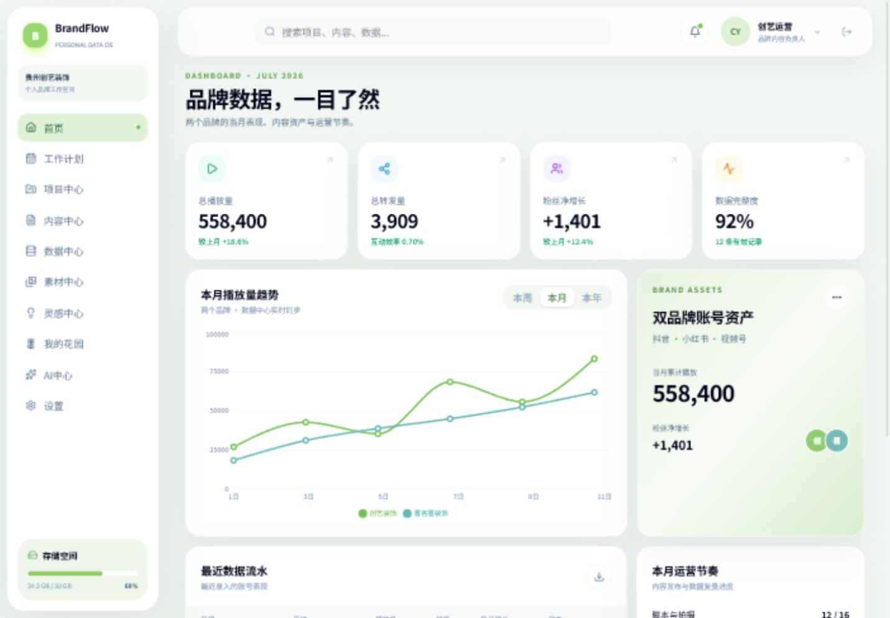

# BrandFlow OS

BrandFlow OS 是面向装修品牌内容运营者的开源个人数据中心，把品牌指标、工作计划、项目、内容、素材、灵感和个人花园集中到一个后台中。



## 功能

- 双品牌周、月、年播放趋势与累计数据看板
- 播放量和转发量录入、更新、删除确认及云端持久化
- 月度计划、周计划和视频主题管理
- 品牌项目、内容生产、素材文件和灵感管理
- Supabase 邮箱认证、Row Level Security 和私有 Storage
- 可交互个人花园，支持种植、浇水和采收
- 响应式浅色 SaaS 界面与 Framer Motion 动效

## 技术栈

- React 19 + TypeScript
- Vite 8
- Tailwind CSS 4
- Framer Motion
- Recharts
- Supabase Auth、Postgres 和 Storage

## 本地运行

### 环境要求

- Node.js 20 或更高版本
- pnpm 10 或更高版本
- 一个 Supabase 项目

### 安装

```bash
git clone <your-repository-url>
cd BrandFlow-OS
pnpm install
```

复制环境变量示例：

```bash
cp .env.example .env.local
```

填写 Supabase 项目配置：

```env
VITE_SUPABASE_URL=https://your-project-ref.supabase.co
VITE_SUPABASE_ANON_KEY=your-publishable-or-anon-key
```

`VITE_SUPABASE_ANON_KEY` 只能使用 Supabase 的 publishable 或 legacy anon key。不要把 secret/service-role key 放进前端环境变量。

### 初始化数据库

在 Supabase SQL Editor 中按文件名顺序执行：

1. `supabase/migrations/202607120001_brandflow_schema.sql`
2. `supabase/migrations/202607120002_seed_modules.sql`

第一份迁移会创建业务表、外键、索引、RLS 策略和私有素材桶。第二份迁移会创建可重复执行的模块初始化函数。

### 启动

```bash
pnpm dev
```

打开 `http://127.0.0.1:5173/`，注册应用账号并完成邮箱确认。首次登录时会自动初始化双品牌示例数据。

未配置 Supabase 环境变量时，应用会退回浏览器 `localStorage` 模式，方便预览界面。

## 数据模型

| 表 | 用途 |
| --- | --- |
| `profiles` | 用户资料 |
| `brands` | 创艺装饰、喜客喜装饰等品牌 |
| `metric_entries` | 品牌每日播放、转发和涨粉数据 |
| `projects` | 品牌视频、案例和内容栏目 |
| `plans` | 月度与周计划 |
| `contents` | 脚本、拍摄、剪辑和发布记录 |
| `assets` | Supabase Storage 文件元数据 |
| `ideas` | 灵感和选题 |
| `garden_state` | 花园水滴与花币 |
| `garden_plots` | 九块花圃的成长状态 |

完整关系见 [Supabase 数据库设计](docs/18-Supabase数据库设计.md)。

## 可用命令

```bash
pnpm dev       # 启动开发服务器
pnpm build     # TypeScript 检查并构建生产版本
pnpm preview   # 预览生产构建
```

## 安全

- 所有用户业务表默认启用 RLS。
- 每条记录通过 `owner_id = auth.uid()` 隔离。
- 素材存储路径以用户 UUID 开头。
- `.env.local` 和其他本地环境文件不会进入版本库。

发现安全问题时请阅读 [SECURITY.md](SECURITY.md)，不要在公开 Issue 中披露密钥或漏洞细节。

## 贡献

欢迎提交 Issue 和 Pull Request。开始前请阅读 [CONTRIBUTING.md](CONTRIBUTING.md)。

## 许可证

[MIT](LICENSE)
