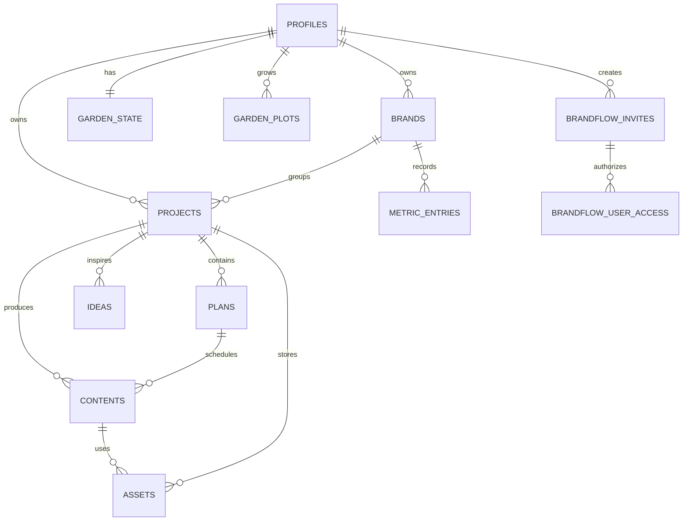

# BrandFlow OS Supabase 数据库设计

## 核心关系

- `profiles`：当前登录用户的个人资料。
- `brands`：用户管理的品牌，当前初始化为创艺装饰和喜客喜装饰。
- `metric_entries`：按品牌、日期和平台记录播放量、转发量和粉丝增长。
- `projects`：品牌视频、完工案例、内容栏目等项目。
- `plans`：月度或周计划，可关联品牌和项目。
- `contents`：具体内容生产记录，可关联品牌、项目和计划。
- `assets`：上传的文件元数据，可关联品牌、项目和内容；文件本体存放在 Supabase Storage。
- `ideas`：灵感记录，可关联品牌或项目。
- `garden_state`：花园水滴、花币和状态。
- `garden_plots`：九块花圃及其花卉成长状态。
- `brandflow_user_access`：已获准进入工作空间的 Auth 用户及其 `super_admin/member` 角色。
- `brandflow_invites`：邀请码哈希、有效期、使用次数和撤销状态。

## 数据串联

## 安全策略

所有业务表启用 Row Level Security。查询、新增、修改和删除同时要求用户已授权且 `owner_id = auth.uid()`，素材文件必须存储在以用户 UUID 命名的目录中。

全新项目的首个 Auth 用户会成为超级管理员，只有该角色可以管理邀请码。后续注册用户为普通成员，由数据库触发器验证六位邀请码；邀请码仅保存 SHA-256 哈希，并支持过期、限次和撤销。
