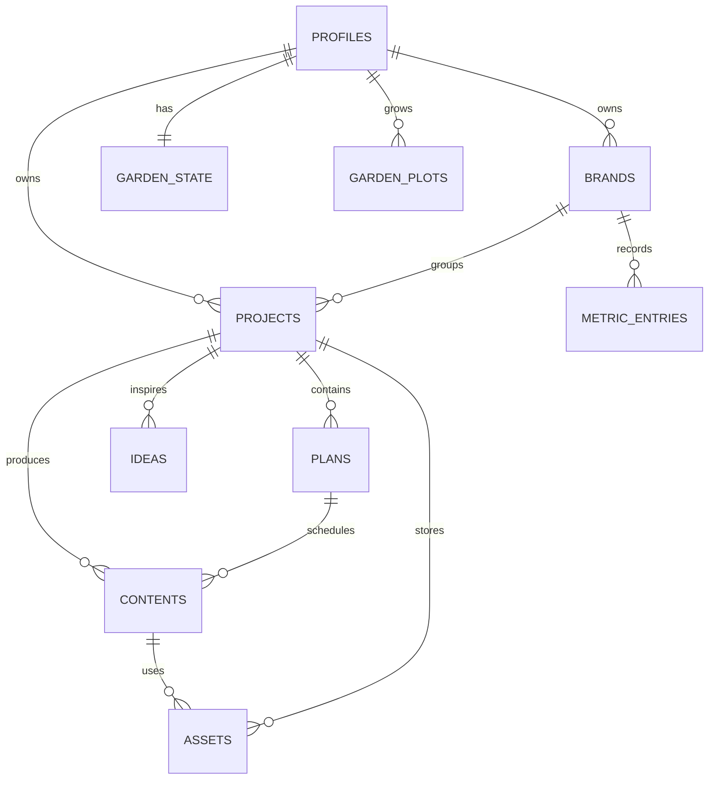

# BrandFlow OS Supabase 数据库设计

## 核心关系

- `profiles`：当前登录用户的个人资料。
- `brands`：用户管理的品牌，当前初始化为创艺装饰和喜客喜装饰。
- `metric_entries`：按品牌、日期和平台记录播放量、转发量和粉丝增长。
- `projects`：品牌视频、完工案例、内容栏目等项目。
- `plans`：月度或周计划，可关联品牌和项目。
- `contents`：具体内容生产记录，可关联品牌、项目和计划。
- `assets`：上传的文件元数据，可关联品牌、项目和内容；文件本体存放在 Supabase Storage。
- `ideas`：灵感记录，可关联品牌或项目。
- `garden_state`：花园水滴、花币和状态。
- `garden_plots`：九块花圃及其花卉成长状态。

## 数据串联

## 安全策略

所有业务表启用 Row Level Security。查询、新增、修改和删除均要求 `owner_id = auth.uid()`，素材文件必须存储在以用户 UUID 命名的目录中。
